# How Piper Reasons — The Thinking Process Behind Every Answer

> This document explains how the Piper AI Agent thinks, acts, learns from mistakes, and generates recommendations. It is written for anyone who wants to understand how an LLM-powered agent goes from a raw user question to a factual, quality-checked answer — without hallucinating product data.

---

## Table of Contents

1. [The Big Picture](#1-the-big-picture)
2. [Intent Classification — Understanding What the User Wants](#2-intent-classification--understanding-what-the-user-wants)
3. [The ReACT Loop — How the Agent Thinks and Acts](#3-the-react-loop--how-the-agent-thinks-and-acts)
4. [History Accumulation — How the Loop Remembers](#4-history-accumulation--how-the-loop-remembers)
5. [Self-Correction — When the Agent Makes a Mistake](#5-self-correction--when-the-agent-makes-a-mistake)
6. [Multi-Agent Orchestration — Divide and Conquer](#6-multi-agent-orchestration--divide-and-conquer)
7. [Reflection — Fixing the Current Response](#7-reflection--fixing-the-current-response)
8. [Reflexion — Learning From Failures Across Sessions](#8-reflexion--learning-from-failures-across-sessions)
9. [Recommendations — What Should the User Ask Next?](#9-recommendations--what-should-the-user-ask-next)
10. [Putting It All Together — Full Example](#10-putting-it-all-together--full-example)

---

## 1. The Big Picture

Every user query passes through a 15-stage pipeline. Some stages are fast regex checks (< 1ms). Others involve one or more LLM calls. The key insight is that **the LLM never has direct database access** — it can only reason about what to look up, call validated tools, and interpret the results. This separation prevents hallucination of product data.



The pipeline has three conceptual phases:

| Phase | Stages | Purpose |
|-------|--------|---------|
| **Understand** | 0-4 | Load context, rewrite query, classify intent, route |
| **Reason** | 5-7 | Plan, think, act, observe (the ReACT loop) |
| **Quality** | 8-13 | Frame, reflect, guard, learn, deliver |

The "Understand" phase determines **what** the user is asking. The "Reason" phase determines **how** to answer using real data. The "Quality" phase ensures the answer is **good enough** before the user sees it.

---

## 2. Intent Classification — Understanding What the User Wants

Before any reasoning begins, the system must understand what the user is asking for. This happens through a single LLM call that outputs three critical signals:



### The Three Signals

**Signal 1: Intent** — What category does this query fall into?

| Intent | Example | What Happens |
|--------|---------|--------------|
| `product_inquiry` | "Tell me about the RoboCleaner 3120" | Full ReACT loop with tools |
| `price_check` | "How much does the UltraWasher cost?" | Full ReACT loop with tools |
| `warranty_question` | "What warranty does the PowerDrill have?" | Full ReACT loop with tools |
| `comparison` | "Compare RoboCleaner vs SuperVac" | Multi-agent or single ReACT |
| `follow_up` | "What about the warranty?" (after discussing a product) | ReACT loop, resolves context |
| `session_query` | "What have I asked so far?" | Answered directly from history, no tools |
| `general_question` | "Hello" or "What can you do?" | Direct LLM response, no tools |
| `out_of_scope` | "Play me a song" | Catalog-aware redirect |

**Signal 2: Domain Relevance** (0.0 to 1.0) — Is this about our product catalog?

This is the first routing gate. Queries scoring below 0.5 are redirected immediately with a helpful message listing what the assistant *can* help with. This prevents the system from wasting expensive ReACT iterations on questions like "What's the weather?" or "Tell me a joke."

- **0.7-1.0 (High):** "Price of UltraWasher 8262" — clearly about products
- **0.4-0.6 (Medium):** "I need something for cleaning" — could be product-related
- **0.0-0.3 (Low):** "Play me a song" — clearly not about products

**Signal 3: Confidence** (0.0 to 1.0) — How sure is the classifier?

When confidence is below 0.8 and the query is ambiguous, the system asks a clarification question instead of guessing. The clarification options are **context-aware** — if the user mentions cleaning, the options are RoboCleaner, SuperVac, and UltraWasher, not generic intents.

### Previous Turn Awareness

The classifier receives the **previous turn's intent and entities** in the prompt. This is how it detects follow-ups. When the user says "What about the warranty?" after a product discussion, the classifier sees the previous intent was `product_inquiry` and the previous entities were product names, so it correctly assigns `follow_up` instead of treating it as an ambiguous new query.

### Query Rewriting — Before Classification

Before classification even begins, an LLM call rewrites the query to be self-contained:

| Raw Query | Conversation Context | Rewritten Query |
|-----------|---------------------|-----------------|
| "How much does it cost?" | Previously discussed RoboCleaner 3120 | "How much does the RoboCleaner 3120 cost?" |
| "Compare them" | Previously discussed UltraWasher and PowerDrill | "Compare the UltraWasher 8262 and PowerDrill 5641" |
| "Tell me more" | Previously discussed EcoKettle | "Tell me more about the EcoKettle 1042" |

This means every downstream stage — intent classification, planning, tool calls — always sees explicit product names. No stage has to guess what "it" or "them" refers to.

---

## 3. The ReACT Loop — How the Agent Thinks and Acts

ReACT (Reasoning + Acting) is the core reasoning engine. It is **not** a fixed "run 8 iterations" loop. It is a **dynamic loop that exits the moment the LLM decides it has enough information to answer.** The maximum of 8 iterations is a safety ceiling, not a target. Most queries finish in 1-3 iterations.



### The Two Patterns

On every iteration, the LLM must produce exactly one of two output patterns:

**Pattern 1 — "I need more information":**

```
Thought: I need to check the warranty for UltraWasher 8262.
Action: warranty_check({"product_name": "UltraWasher 8262"})
```

The agent names a tool and provides parameters. The system executes the tool and feeds the result back as an **Observation**.

**Pattern 2 — "I'm ready to answer":**

```
Thought: I now have warranty details. The UltraWasher has a 6-month warranty.
Answer: The UltraWasher 8262 comes with a 6-month manufacturer's warranty...
```

The agent provides a final answer. **The loop exits immediately.**

### What the LLM Sees

Each iteration, the LLM receives:

| Prompt Section | Content | Purpose |
|----------------|---------|---------|
| **System prompt** | Tool descriptions + rules + output format | Tells the LLM what tools exist and how to format responses |
| **Reflexion insights** | Past learnings from failures (e.g., "Always search before checking warranty") | Prevents repeating past mistakes |
| **Plan** | Execution steps from the planning stage (e.g., "1. Check warranty 2. Look up price") | Gives the LLM a roadmap so it doesn't wander |
| **Memory context** | Structured conversation history | Gives awareness of what was already discussed |
| **Query** | The (rewritten) user question | What to answer |
| **History** | All previous Thought/Action/Observation triplets | Accumulated knowledge from prior iterations |

The **history** section is what makes the loop work. Each iteration builds on everything that came before. The LLM doesn't re-read the database — it sees the tool results from previous iterations and reasons about what it still needs.

### What Controls Loop Termination

| Exit Condition | What Happens |
|----------------|--------------|
| LLM outputs `Answer:` | Loop breaks immediately — the normal, happy path |
| LLM outputs neither Action nor Answer | Raw output treated as answer, loop breaks |
| 8 iterations exhausted | Force-generates an answer from collected observations |
| 120-second timeout exceeded | Returns a timeout message |

The 120-second timeout is a hard safety net. In practice, most queries complete well within this — a single-tool query takes 2-4 seconds total, and a complex multi-tool query takes 6-12 seconds.

---

## 4. History Accumulation — How the Loop Remembers

The critical mechanism is `build_react_history()`. After each iteration, the thought, action, and observation are appended to a growing history string. On the next LLM call, the model sees **all** previous reasoning. This is what gives the loop memory.



### Concrete Example

Query: **"What's the warranty on UltraWasher 8262 and how much does it cost?"**

**Iteration 1:** The LLM has the plan ("1. Check warranty 2. Look up price") and decides:

```
Thought: I need to check the warranty for UltraWasher 8262 first, as the plan suggests.
Action: warranty_check({"product_name": "UltraWasher 8262"})
```

Tool Service calls PostgreSQL, returns:

```
Observation: UltraWasher 8262: 6-month warranty, manufactured 2023-09-21, price $121.24
```

**Iteration 2:** The LLM now sees Iteration 1's full record in its history. It notices the warranty check already returned the price:

```
Thought: I now have both the warranty (6 months) and price ($121.24) from the
         warranty check. I don't need a separate price_lookup call.
Answer: The UltraWasher 8262 is priced at $121.24 and comes with a 6-month
        manufacturer's warranty starting from September 21, 2023.
```

**Loop exits after 2 iterations.** The plan suggested 2 tool calls, but the LLM was smart enough to realize one tool returned both pieces of data. This is why the loop is dynamic — the LLM decides when it has enough, not the code.

---

## 5. Self-Correction — When the Agent Makes a Mistake

The ReACT loop has five built-in recovery paths. None of them crash the loop. They all produce an **Observation** that guides the LLM to fix its own mistake on the next iteration.



### The Five Recovery Paths

| Error | What the LLM Sees as Observation | Typical Self-Correction |
|-------|----------------------------------|------------------------|
| **Wrong parameter name** | `"Parameter validation error: Missing required field 'product_name'"` | LLM reads the error, fixes the field name |
| **Invalid parameter format** | `"Parameter validation error: 'top_k' must be an integer"` | LLM adjusts the format |
| **Unknown tool name** | `"Unknown tool: warrnty_check. Available tools: warranty_check, price_lookup..."` | LLM sees the correct spelling |
| **Tool execution fails** | `"Tool execution failed: Product not found"` | LLM tries a different search term or tool |
| **Incomplete tool result** | Enriched observation: `"Result contains price but no warranty data. Consider using warranty_check."` | LLM makes an additional tool call |

### Why This Works

The key design principle: **errors are not exceptions, they are observations.** The LLM treats a validation error the same way it treats a successful tool result — as information to reason about. Since the error message includes the correct field name or available tools, the LLM has everything it needs to self-correct.

This typically costs one extra iteration (the failed attempt + the corrected attempt), but it means the system recovers gracefully from LLM formatting mistakes without human intervention.

---

## 6. Multi-Agent Orchestration — Divide and Conquer

When a query touches multiple domains (e.g., "Compare the warranty of UltraWasher 8262 with RoboCleaner 3000"), the Planning stage sets `needs_multi_agent: true` and lists specialist agents. Instead of one long ReACT loop, the system runs **multiple shorter loops in sequence**.



### How It Differs from Single-Agent

| Aspect | Single Agent | Multi-Agent |
|--------|-------------|-------------|
| **Max iterations** | 8 per loop | 4 per specialist |
| **System prompt** | Generic | Specialized per agent |
| **Tool bias** | All tools equal | Preferred tools listed first |
| **Output** | Direct answer | Per-specialist answer, then synthesized |

### The Three Specialist Agents

| Agent | Focus | Preferred Tools |
|-------|-------|-----------------|
| `product_specialist` | Features, specifications | `product_search`, `price_lookup` |
| `warranty_specialist` | Warranty policies, coverage | `warranty_check` |
| `comparison_specialist` | Multi-dimension comparison | `product_compare`, `price_lookup` |

### The Synthesis Step

After all specialists finish, a final LLM call combines their outputs:

```
Specialist outputs:
[warranty_specialist]: UltraWasher has 6 months, RoboCleaner has 36 months.
[comparison_specialist]: RoboCleaner is more expensive but offers 6x longer coverage.

→ Synthesized: "The RoboCleaner 3000 offers significantly longer warranty coverage
   at 36 months compared to the UltraWasher 8262's 6-month warranty..."
```

This division of labor means each specialist can focus deeply on its domain with a short loop, rather than one agent trying to juggle warranty lookups and price comparisons in a single 8-iteration window.

---

## 7. Reflection — Fixing the Current Response

After the ReACT loop produces a raw answer, the system asks: **"Is this response actually good?"** Reflection is a post-processing quality gate that can catch and fix problems before the user sees the response.



### The Two Roles

Reflection uses two distinct LLM calls, each with a different job:

**The Evaluator** scores the response on five criteria:

| Criterion | What It Measures | Low Score Example |
|-----------|-----------------|-------------------|
| **Completeness** | Does it fully answer the question? | User asked to compare two products but only one was discussed |
| **Accuracy** | Is it factually correct per tool results? | Response says warranty is 12 months but tool returned 6 |
| **Relevance** | Is it focused on what was asked? | Response includes unsolicited product recommendations |
| **Clarity** | Is it clear and easy to understand? | Response is disorganized, mixing unrelated facts |
| **Actionability** | Does it give useful next steps? | Response states facts but offers no follow-up options |

The evaluator produces an `overall_score` (0.0 to 1.0), a list of `issues`, and a `needs_refinement` flag.

**The Refiner** takes the critique and improves the response. Crucially, the refiner receives the **raw tool observations** from the ReACT loop. Even if the ReACT answer missed some data, the tool observations contain it — the refiner can use this data to produce a more complete answer.

### The Loop Control

```
for iteration in 1..2:
    score = evaluate(response)
    if score >= 0.75 → PASS (response is good enough)
    if not needs_refinement → ACCEPT as-is
    response = refine(response, critique, tool_observations)

After 2 iterations → use whatever we have
```

Every failure mode defaults to **pass-through**. If the evaluator returns invalid JSON, the score defaults to 1.0 (response passes). If the refiner fails, the previous version is kept. Reflection can only improve a response, never block delivery.

### Concrete Example

Query: "Compare the warranty of UltraWasher 8262 with RoboCleaner 3000"

The ReACT loop only checked one product. The raw answer is: *"The UltraWasher 8262 has a 6-month warranty."* (missing the comparison entirely).

```
Evaluation 1:
  completeness: 0.3   ← only one product discussed
  accuracy: 1.0       ← what it said was correct
  overall_score: 0.52  ← below 0.75 threshold
  issues: ["Only checked one product's warranty"]
  needs_refinement: true

Refinement 1:
  The refiner sees the tool observations which contain BOTH warranty results.
  Produces: "The RoboCleaner 3000 has a longer warranty at 36 months compared
            to the UltraWasher 8262's 6-month warranty."

Evaluation 2:
  overall_score: 0.89  ← above 0.75 → PASS
```

The user sees the complete comparison, not the partial answer.

---

## 8. Reflexion — Learning From Failures Across Sessions

Reflection fixes the **current** response. Reflexion learns from failures to improve **future** responses. They are architecturally independent systems.

### The Write Path (Storing Lessons)

After the response is delivered, the system checks: was the **original** reflection score (before any refinement) below 0.7? If yes, the agent failed to produce a good answer on the first try. A dedicated LLM call analyzes what went wrong:

```
Input:
  Query: "What warranty does ProductX have?"
  Original score: 0.45
  Issues: ["Product not found", "Response was generic"]

Output (stored to TimescaleDB):
  summary: "Always use product_search first to get the exact product name,
            then call warranty_check with the matched name"
  key_topics: ["warranty", "product_search", "ProductX"]
  metadata.intent: "warranty_question"
```

This insight is **permanent** — stored as an immutable episodic memory in TimescaleDB.

### The Read Path (Applying Lessons)

At the very start of the ReACT loop (before the first iteration), the system fetches up to 3 relevant past insights and injects them into the system prompt:

```
Learnings from past interactions (use these to improve your response):
- Always use product_search first to get the exact product name,
  then call warranty_check with the matched name
- When comparing warranties, check all products before generating the answer
```

The LLM sees these learnings before its first Thought. They influence tool selection and reasoning order.

### Why This Matters

Without Reflexion, the agent would make the same mistakes repeatedly. With it, the agent builds a persistent memory of what works and what doesn't. A mistake in Session 1 prevents the same mistake in Session 50.

| Session | Without Reflexion | With Reflexion |
|---------|-------------------|----------------|
| Session 1 | Calls `warranty_check("ProductY")` directly → fails (wrong name) | Same failure, but insight is stored |
| Session 2 | Same failure pattern repeats | Sees insight: "search first, then check warranty" → calls `product_search` first → succeeds |

---

## 9. Recommendations — What Should the User Ask Next?

After every response, the recommendation engine generates exactly 3 contextual follow-up suggestions. These are **anchored to what the user is currently discussing**, not random product suggestions.



### The Core Idea: Focus-Anchored Intent Strategy

The old approach used "gap analysis" — suggesting topics the user *hadn't* explored. This produced off-topic suggestions like recommending PowerDrill warranties after the user was discussing RoboCleaner pricing.

The new approach anchors every suggestion to the **current product** and uses the **current intent** to decide what aspect to suggest next:

| If the User Just Asked About... | Slot 1 Suggests | Slot 2 Suggests |
|--------------------------------|-----------------|-----------------|
| Product details (`product_inquiry`) | Warranty on that product | Price of that product |
| Price (`price_check`) | Warranty on that product | Compare with similar-priced alternatives |
| Warranty (`warranty_question`) | Price of that product | Compare warranty across brands |
| Comparison (`comparison`) | Features of that product | Price of that product |

**Slot 3** adds cross-user intelligence: "Users who asked about RoboCleaner 3120 also explored PowerDrill 5641." This is computed from actual session data across all customers — products that frequently co-occur in the same conversations.

### Follow-Up Intent Resolution

When the current intent is `follow_up`, the system resolves to the **previous** non-follow_up intent. If the user said "Tell me more" after a `price_check`, the recommendations use the `price_check` strategy (warranty + alternatives), not a generic fallback.

### Cold Start — When There's No Conversation Yet

At session start, the system cascades through four tiers:

| Tier | Condition | Strategy |
|------|-----------|----------|
| **1C** | Returning customer with episodic memory | "Continue where you left off: {last_topic}" |
| **1A** | Platform has usage data | Most popular products by unique customer count |
| **1B** | No popular products yet | Most expensive product per brand (premium showcase) |
| **Generic** | Nothing above worked | Brand names and price ranges from catalog |

---

## 10. Putting It All Together — Full Example

Query: **"Compare the warranty of UltraWasher 8262 with RoboCleaner 3000"**

### Stage 0-2: Understand

```
1. Load conversation history → structured memory context
2. Input guardrails → safe (no injection, no PII)
3. Query rewriting → no pronouns to resolve, query unchanged
```

### Stage 3-4: Classify and Route

```
Intent classification:
  intent: "comparison"
  confidence: 0.92
  domain_relevance: 0.95
  needs_clarification: false

Routing: confidence >= 0.8 + domain_relevance >= 0.5 → Normal path (Path C)
```

### Stage 5: Plan

```
Plan:
  needs_multi_agent: true
  plan_steps:
    1. Check UltraWasher warranty (warranty_check)
    2. Check RoboCleaner warranty (warranty_check)
    3. Compare warranty terms
  specialist_agents: [warranty_specialist, comparison_specialist]
```

### Stage 6-7: Multi-Agent Reasoning

**Warranty Specialist** (sub-loop, max 4 iterations):

```
Iteration 1:
  Thought: I need to check UltraWasher 8262's warranty.
  Action: warranty_check({"product_name": "UltraWasher 8262"})
  Observation: 24 months from Jan 2024

Iteration 2:
  Thought: Now I need RoboCleaner 3000's warranty.
  Action: warranty_check({"product_name": "RoboCleaner 3000"})
  Observation: 36 months from Feb 2024

Iteration 3:
  Thought: I have both warranties.
  Answer: UltraWasher has 24 months, RoboCleaner has 36 months.
```

**Comparison Specialist** (sub-loop, max 4 iterations):

```
Iteration 1:
  Thought: I should compare these products side by side.
  Action: product_compare({"product_names": ["UltraWasher 8262", "RoboCleaner 3000"]})
  Observation: Feature comparison table with prices, warranties, descriptions

Iteration 2:
  Thought: I have the comparison data.
  Answer: RoboCleaner costs more but offers 12 months more warranty coverage.
```

**Synthesis LLM call** combines both:

> "The RoboCleaner 3000 offers a longer warranty at 36 months (valid through Feb 2027) compared to the UltraWasher 8262's 24-month warranty (valid through Jan 2026). The RoboCleaner gives you an additional 12 months of coverage."

### Stage 8-9: Quality Check

```
Response Framing: adds confidence (0.91) and sources

Reflection Evaluation:
  completeness: 0.95  ← both products covered
  accuracy: 1.0       ← matches tool results
  overall_score: 0.88  ← above 0.75 → PASS (no refinement needed)
```

### Stage 10-13: Deliver

```
Output Guardrails: no PII found
Reflexion: original_score 0.88 >= 0.7 → no insight stored (agent did well)
Evaluation: metrics stored to TimescaleDB
Response streamed to user + 3 recommendations:
  1. "What's the price of RoboCleaner 3000?"
  2. "Compare warranty options across brands"
  3. "Users who asked about RoboCleaner 3000 also explored PowerDrill 5641"
```

---

## Key Takeaways

1. **The LLM never touches the database directly.** It can only reason, request tool calls, and interpret results. This eliminates hallucination of product data.

2. **The loop is dynamic, not fixed.** The LLM exits the moment it has enough information. Most queries need 1-3 iterations, not 8.

3. **Errors are observations, not exceptions.** A wrong parameter name becomes a learning signal for the next iteration, not a crash.

4. **History accumulates across iterations.** Each step sees all previous steps, giving the LLM memory within the loop.

5. **Reflection fixes now, Reflexion fixes forever.** The evaluator catches problems in the current response. Persistent insights prevent the same mistakes in future sessions.

6. **Recommendations follow the user's focus.** Suggestions are anchored to the current product and intent, not random exploration.

7. **Every failure mode defaults to pass-through.** No single component failure can block response delivery. The system degrades gracefully at every stage.

---

_Piper AI Agent — Reasoning Process Documentation_
